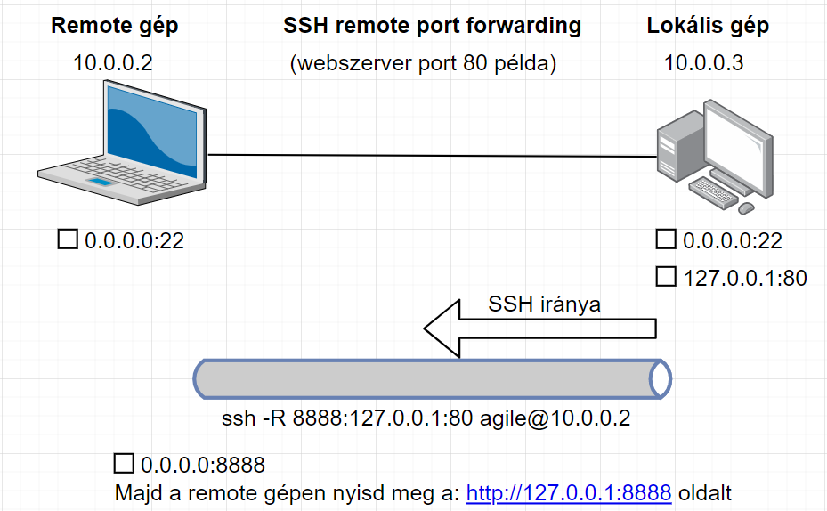
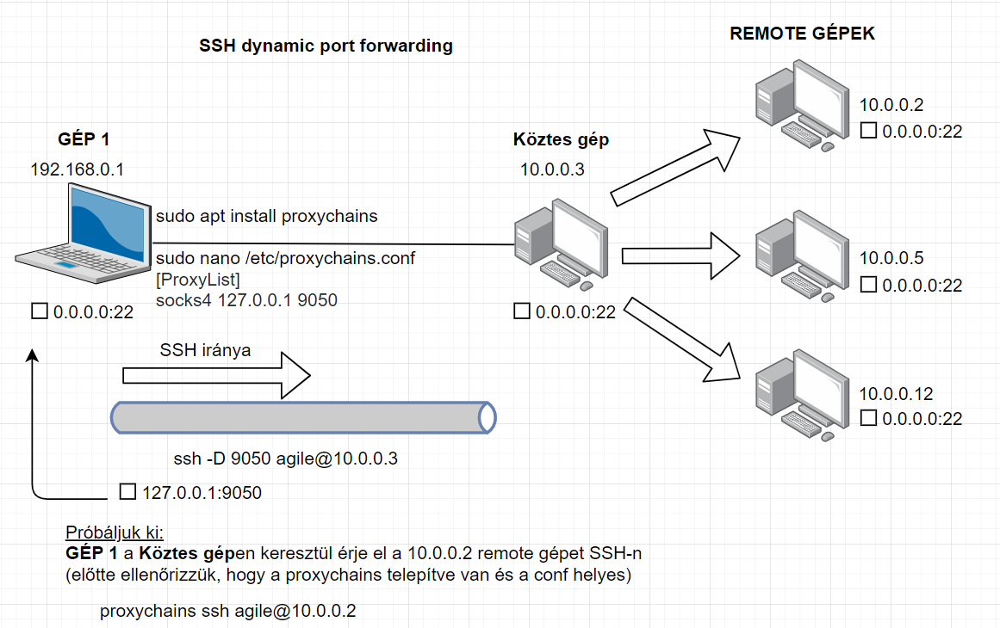

# SSH Tunneling
A következőekben a GNS3 teszkörnyezetben kipróbálható parancsokkal
szemléltetem a különböző port forwarding technikákat.

## Tesztkörnyezet infó

Gép neve | IP
------------ | -------------
HOME_PC | 192.168.0.1
CLOUD_PC | 10.0.0.3
REMOTE_PC | 10.0.0.2

megjegyzés: a CLOUD_PC-n szükséges egy webszerver a 80-as porton, a példák kipróbálásához.
Egy egyszerű webszervert a következő parancsokkal tudsz telepíteni:

```sh
sudo apt update
sudo apt install apache2 -y
```

## Local port forwarding
Lényege, hogy a lokális gépről a távoli gépre be SSH-zunk és onnan a távoli remote portot 
"áthúzzunk" a lokális gépünk egy tetszőleges portjára.

**Szintaxis:**
```sh
ssh -L <lokális_gépen_nyitandó_port>:127.0.0.1:<távoli_remote_port> agile@REMOTE_IP
```

**Példa:**
A távoli gépen fut egy webszerver ami csak a localhost 80-as porton érhető el. 
SSH-zni tudunk a remote gépre, így egy local port forwardinggal a lokális gépre ki tudjuk húzni azt a
remote 80-as portot.

```sh
 # Lokális gép
 ssh -L 8080:127.0.0.1:80 agile@10.0.0.3
```


## Remote port forwarding
A lokális gép egy portját, a remote gép egy tetszőleges portjára kitesszük remote port forwarding segítségével.

**Szintaxis:**
```sh
ssh -R <remote_gépen_nyitandó_port>:127.0.0.1:<lokális_port> agile@REMOTE_IP
```

**Példa:**
A lokális gépen fut egy webszerver ami csak a localhost 80-as porton érhető el.
A remote gép számára szeretnénk biztosítani, hogy láthassa a webszerver tartalmát.

```sh
 # Lokális gép
 ssh -R 8888:127.0.0.1:80 agile@10.0.0.2
```



## Dynamic port forwarding
Egy köztes gépen keresztül tudunk elérni olyan távoli gépeket, ami a forrás gép számára
elérhetetlenek, de a köztes gép számára elérhetőek. A köztes gép proxy-ként működik, és
rajta keresztül jut el a kérésünk a távoli gép(ek) felé. Ezzel a megoldással több gépet
és több portot is el tudunk érni egyszerre.

**Szintaxis:**
```sh
 ssh -D 9050 agile@KOZTES_GEP_IP
```

**Példa:**
A GÉP1 el szeretne érni olyan gépeket, amelyekre nincs rálátása. GÉP1-nek van hozzáférése
egy olyan köztes géphez, aminek van rálátása az elérni kívánt távoli gépekhez.
GÉP1 egy dinamikus tunnelt épít ki a köztes géppel, hogy rajta keresztül el tudja érni a
távoli gépeket.

```sh
 # GÉP1
 # előkészületek
 sudo apt update
 sudo apt install proxychains
 sudo nano /etc/proxychains.conf  # legyen egy ilyen sor a configban, ha nem lenne: socks4 127.0.0.1 9050

 # dynamic tunnel
  ssh -D 9050 agile@10.0.0.3

 # távoli gép elérése a tunnelen keresztül
 proxychains ssh agile@10.0.0.2
```


