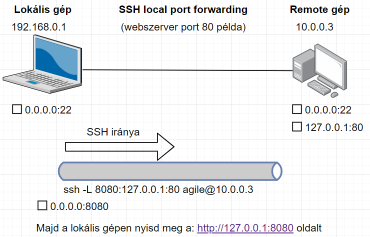

# SSH Tunneling
A következőekben a GNS3 teszkörnyezetben kipróbálható parancsokkal
szemléltetem a különböző port forwarding technikákat.

##Teszt környezet infó
| Gép neve | IP |
| HOME_PC | 192.168.0.1 |
| CLOUD | 10.0.0.3 |
| REMOTE_PC | 10.0.0.2 |


## Local port forwarding
Lényege, hogy a lokális gépről a távoli gépre be SSH-zunk és onnan a távoli remote portot 
"áthúzzunk" a lokális gépünk egy tetszőleges portjára.

**Szintaxis:**
```sh
ssh -L <lokális_gépen_nyitandó_port>:127.0.0.1:<távoli_remote_port> agile@REMOTE_IP
```

**Példa:**
A távoli gépen fut egy webszerver ami csak a localhost 80-as porton érhető el. 
SSH-zni tudunk a remote gépre, így egy local port forwardinggal a lokális gépre ki tudjuk húzni azt a
remote 80-as portot.

```sh
 ssh -L 8080:127.0.0.1:80 agile@10.0.0.3
```


